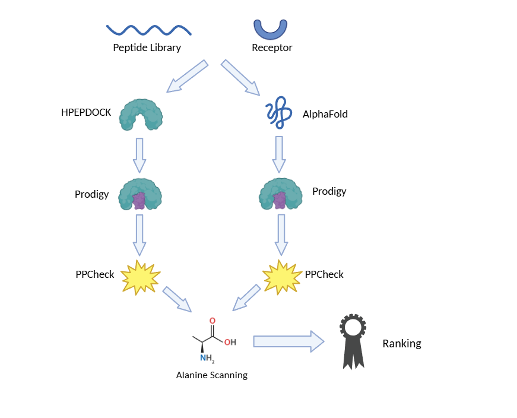

# CypA Peptide Docking Study
### Computational Identification of High-Affinity Mimetic Peptides for Cyclophilin A Neutralization via Iterative Docking and Interface Analysis

> **Ravi Shah · Illinois Mathematics and Science Academy (IMSA)**  
> **Supervised by Dr. Jose Villegas & Dr. Arumay Pal · UIC College of Pharmacy**

---

## Overview

This repository documents a computational pipeline for identifying peptide sequences that bind Cyclophilin A (CypA) with high affinity. Starting from a minimal 2-residue fragment (`GP`), peptide candidates were systematically extended and evaluated using a multi-step workflow: peptide–protein docking via **HPepDock** and **AlphaFold**, thermodynamic scoring via **PRODIGY**, and interface contact analysis via **PPCheck**. Structure quality was assessed using **pLDDT** scores. Alanine scanning mutagenesis was performed through a PyMOL–HPepDock–PRODIGY–PPCheck pipeline to identify per-residue energetic contributions.

A total of **28 CypA–peptide complexes** were evaluated, ranging from `cypA_GP` (2 residues) to `cypA_WDRVHPVHAGPIAPGQMREPR` (21 residues), under both docking approaches in parallel. Alanine scanning was completed for `cypA_WDRVHPVHAGPIAPGQMREPR` across both pipelines.

---

## Repository Structure

```
CypA-Peptide-Docking-Study/
│
├── README.md
│
├── data/
│   ├── results_HPEPDOCK_summarized.md     ← Summary results from HPepDock pipeline
│   └── results_alphafold_summarized.md    ← Summary results from AlphaFold pipeline
│
├── structures_HPEPDOCK/
│   ├── cypA.pdb                           ← CypA receptor structure
│   └── docked_complexes/                  ← Top-ranked HPepDock complex per peptide
│
├── structures_alphafold/                  ← AlphaFold-predicted complex structures
│
├── figures/                               ← Charts and PyMOL screenshots
│
├── alanine_scan/
│   ├── mutants_HPEPDOCK/                  ← Ala mutant PDBs from HPepDock pipeline
│   ├── mutants_alphafold/                 ← Ala mutant PDBs from AlphaFold pipeline
│   ├── results_HPEPDOCK.md               ← Alanine scan results for HPepDock complexes
│   └── results_alphafold.md              ← Alanine scan results for AlphaFold complexes
│
└── references/                            ← Papers and citations
```

---

## Methods



---

### 1. Peptide Library Design

Peptide candidates were generated by iteratively extending a proline-rich core motif anchored around the sequence `AGPIAPGQMREPR`, a region predicted to occupy the active-site cleft of CypA. Flanking residues were added one or two at a time based on the known CypA-binding preferences for hydrophobic and proline-containing sequences. A total of 28 unique peptides ranging from 2 to 21 residues were generated. All peptides were modeled as linear (unmodified) chains in extended conformations. Each peptide was evaluated under two independent docking pipelines — HPepDock and AlphaFold — to allow cross-validation of predicted binding poses and thermodynamic estimates.


---

### 2. Peptide–Protein Docking: HPepDock

**Tool**: [HPepDock](http://huanglab.phys.hust.edu.cn/hpepdock/)  
**Reference**: Wen, H. et al. *HPepDock: a web server for blind peptide-protein docking based on a hierarchical algorithm and known structural information.* Nucleic Acids Research (2019).

HPepDock is a web-based server designed specifically for peptide–protein docking. It uses a **hierarchical docking algorithm** that first places the peptide in candidate binding regions of the receptor using a global search across the receptor surface, then refines docked poses using energy-based local minimization. A key feature of HPepDock is its use of structural information from experimentally characterized peptide–protein complexes archived in the PDB, which biases pose sampling toward conformationally realistic binding geometries. This is particularly valuable for proline-rich peptides, where backbone dihedral angles are constrained by the cyclic pyrrolidine ring and non-standard conformational preferences.

For each of the 28 peptides, the CypA receptor PDB was submitted alongside the peptide sequence. HPepDock returns a ranked list of docked complex models; the **top-ranked cluster representative** was used for all downstream analyses. Docking scores are dimensionless values where more favorable (larger absolute) scores indicate better-predicted complementarity between peptide and receptor.

---

### 3. Peptide–Protein Docking: AlphaFold

**Tool**: [AlphaFold](https://alphafold.ebi.ac.uk/) / AlphaFold-Multimer  
**Reference**: Jumper, J. et al. *Highly accurate protein structure prediction with AlphaFold.* Nature (2021); Evans, R. et al. *Protein complex prediction with AlphaFold-Multimer.* bioRxiv (2021).

AlphaFold predicts three-dimensional protein structures directly from amino acid sequences using a deep learning architecture trained on the Protein Data Bank. For peptide–protein complex prediction, **AlphaFold-Multimer** was used, which extends the original single-chain model to handle multi-chain inputs. Rather than treating docking as a search problem (as HPepDock does), AlphaFold generates a co-folded prediction of the full CypA–peptide complex in a single forward pass, leveraging co-evolutionary information encoded in the model weights.

Each peptide sequence was submitted alongside the CypA sequence as a multimer input. The top-ranked model (ranked by predicted interface pTM score) was used for downstream analyses. Per-residue **pLDDT** scores from the AlphaFold output serve as the primary structure quality metric. AlphaFold structures were stored separately in `structures_alphafold/` to maintain a clean separation between the two pipelines.

---

### 4. Binding Free Energy and Dissociation Constant: PRODIGY

**Tool**: [PRODIGY](https://wenmr.science.uu.nl/prodigy/) (PROtein binDING enerGY)  
**Reference**: Vangone, A. & Bonvin, A.M. *Contacts-based prediction of binding affinity in protein-protein complexes.* eLife (2015); Xue, L.C. et al. *PRODIGY: a web server for predicting the binding affinity of protein-protein complexes.* Bioinformatics (2016).

PRODIGY predicts the binding free energy (ΔG, kcal/mol) and equilibrium dissociation constant (K_d, M) of a protein–protein or protein–peptide complex directly from the 3D atomic coordinates. The underlying model is a linear regression trained on a benchmark dataset of experimentally determined binding affinities from the PDBbind database.

The primary input features are the **inter-chain residue–residue contacts** at the binding interface, classified by the physicochemical properties of the contacting residue pair:

| Contact Type | Description |
|---|---|
| Charged–Charged (CC) | e.g., Arg–Glu, Lys–Asp |
| Charged–Polar (CP) | e.g., Arg–Ser, Lys–Asn |
| Charged–Apolar (CA) | e.g., Arg–Ile, Glu–Leu |
| Polar–Polar (PP) | e.g., Ser–Thr, Asn–Gln |
| Polar–Apolar (PA) | e.g., Ser–Val, Thr–Ile |

These contact counts, combined with the **non-interacting surface area (NIS)** partitioned into charged and apolar components, are used in the regression model to estimate ΔG. The dissociation constant is derived via:

```
ΔG = RT ln(Kd)   →   Kd = exp(ΔG / RT)
```

where R = 1.987 cal/mol·K and T = 298.15 K (25°C). PRODIGY was applied independently to both HPepDock and AlphaFold top-ranked complexes.

---

### 5. Interface Contact Analysis: PPCheck

**Tool**: [PPCheck](https://caps.ncbs.res.in/ppcheck/index.html) — National Centre for Biological Sciences (NCBS), Bangalore  
**Reference**: Harini, K. & Sowdhamini, R. *Computational approaches for decoding select odorant-olfactory receptor interactions using mini-virtual screening.* PloS One (2015).

PPCheck (Protein–Protein interaction CHECKer) performs a detailed structural dissection of the binding interface between two protein chains. For each submitted complex, PPCheck computes:

**Contact Classification**  
Inter-chain contacts are enumerated and categorized by residue type (charged, polar, apolar), providing an orthogonal contact-level view of the interface composition alongside PRODIGY's thermodynamic estimates.

**Energetic Decomposition**  
PPCheck decomposes the total interface stabilization energy (kJ/mol) into three components:
- *H-Bond Energy*: Calculated from hydrogen bond geometry (donor–acceptor distance and angle), reflecting polar complementarity.
- *Electrostatic Energy*: Coulombic interactions between charged interface residues, reflecting salt bridge and long-range charge contributions.
- *Van der Waals Energy*: Short-range Lennard-Jones dispersion interactions, the dominant force in hydrophobic packing.

**Normalized Energy**  
Total stabilizing energy divided by the number of interface residues (kJ/mol per residue), allowing fair comparison across peptides of different lengths.

**Structural Features**  
PPCheck additionally reports: interface residue count, short contacts (steric clashes), hydrophobic interaction count, vdW pairs, salt bridges, and favorable/unfavorable electrostatics breakdown.

PPCheck was applied to top-ranked complexes from both the HPepDock and AlphaFold pipelines.

---

### 6. Structure Quality Assessment: pLDDT

**pLDDT** (predicted Local Distance Difference Test) is a per-residue confidence metric from AlphaFold, ranging from 0 to 100. It estimates how well the predicted local structure agrees with an experimental-quality model based on the model's internal self-consistency.

| pLDDT Range | Interpretation |
|---|---|
| > 90 | Very high confidence — backbone and side chain placement reliable |
| 70–90 | Confident — generally correct fold |
| 50–70 | Low confidence — treat with caution |
| < 50 | Very low — likely disordered or prediction artifact |

pLDDT scores were recorded for all complexes as a quality filter. Complexes with pLDDT < 50 were flagged and their binding metrics interpreted conservatively.

---

### 7. Alanine Scanning Mutagenesis

Alanine scanning maps the energetic contribution of individual residues to binding affinity. Each non-alanine residue in the peptide is substituted with alanine and the change in binding free energy (ΔΔG) is computed. Residues with ΔΔG > 1.0 kcal/mol are designated **hotspot residues**. The pipeline was run independently for both HPepDock and AlphaFold complexes on the top candidate peptide `cypA_WDRVHPVHAGPIAPGQMREPR`.

**Pipeline:**

**Step 1 — In silico mutagenesis (PyMOL Mutagenesis Wizard)**  
Each non-alanine residue in the peptide chain is substituted with alanine using the PyMOL Mutagenesis Wizard. The highest-population rotamer is selected and the mutant structure is exported as a new PDB file.

**Step 2 — Re-docking (HPepDock) and Re-prediction (AlphaFold 3)**  
Each alanine mutant is run through both pipelines independently, mirroring the same dual-pipeline approach used for the wildtype peptides. The mutant PDB is re-submitted to HPepDock for a fresh docked pose, and the mutant sequence is simultaneously re-submitted to AlphaFold 3 for a fresh co-folded complex prediction.

**Step 3 — Rescoring (PRODIGY)**  
The top-ranked output for each mutant is submitted to PRODIGY to obtain ΔG_mut.

**Step 4 — Interface profiling (PPCheck)**  
Each mutant complex is submitted to PPCheck to profile interface changes resulting from the mutation.

**Step 5 — ΔΔG Calculation**

```
ΔΔG = ΔG_mut − ΔG_wt
```

Positive ΔΔG → residue is stabilizing (mutation weakens binding).  
Negative ΔΔG → residue is destabilizing in wildtype form.  
|ΔΔG| > 1.0 kcal/mol → residue flagged as a hotspot.

---

## Results Summary

*Full results are in `data/results_HPEPDOCK_summarized.md` and `data/results_alphafold_summarized.md`.*

### HPepDock Pipeline — Top Complexes (by ΔG)

| Peptide | # Residues | ΔG (kcal/mol) | K_d (M) | vdW Energy (kJ/mol) | pLDDT |
|---|---|---|---|---|---|
| `cypA_AGPIA` | 5 | −10.4 | 2.3×10⁻⁸ | −111.23 | 96.20 |
| `cypA_WDRVHPVHAGPIAPGQM` | 17 | −10.4 | 2.4×10⁻⁸ | −133.28 | 82.52 |
| `cypA_WDRVHPVHAGPIAPGQMREP` | 20 | −10.1 | 3.8×10⁻⁸ | −148.68 | 86.43 |
| `cypA_WDRVHPVHAGPIAP` | 14 | −10.0 | 4.3×10⁻⁸ | −176.37 | 90.35 |
| `cypA_HPVHAGPIA` | 9 | −9.7 | 7.9×10⁻⁸ | −130.57 | 95.25 |
| `cypA_WDRVHPVHAGPIAPGQMREPR` | 21 | −9.7 | 8.3×10⁻⁸ | −122.79 | 88.82 |

### AlphaFold 3 Pipeline — Top Complexes (by ΔG)

| Peptide | # Residues | ΔG (kcal/mol) | K_d (M) | vdW Energy (kJ/mol) | pLDDT |
|---|---|---|---|---|---|
| `cypA_HAGPIAPGQMREPR` | 14 | −11.0 | 8.1×10⁻⁹ | −223.71 | 91.95 |
| `cypA_HPVHAGPIAPGQMREPR` | 17 | −8.1 | 1.1×10⁻⁶ | −208.37 | 91.46 |
| `cypA_WDRVHPVHAGPIA` | 13 | −7.8 | 1.9×10⁻⁶ | −140.44 | 84.66 |
| `cypA_PVHAGPIAPGQMREPR` | 16 | −7.7 | 2.1×10⁻⁶ | −210.79 | 90.31 |
| `cypA_WDRVHPVHAGPIAPGQMREP` | 20 | −7.5 | 3.0×10⁻⁶ | −182.99 | 86.43 |
| `cypA_WDRVHPVHAGPIAPGQMREPR` | 21 | −7.1 | 6.4×10⁻⁶ | −177.97 | 88.82 |

### Head-to-Head Comparison (All Peptides)

| Peptide | # Residues | ΔG HPepDock | ΔG AlphaFold 3 | vdW HPepDock | vdW AlphaFold 3 |
|---|---|---|---|---|---|
| `cypA_AGPI` | 4 | −6.3 | −5.2 | −100.03 | −69.99 |
| `cypA_AGPIA` | 5 | −10.4 | −5.8 | −111.23 | −105.20 |
| `cypA_VHAGPIA` | 7 | −7.3 | −6.4 | −118.82 | −140.59 |
| `cypA_PVHAGPIAP` | 9 | −8.6 | −6.5 | −128.44 | −154.80 |
| `cypA_VHAGPIAPG` | 9 | −4.5 | −6.4 | −148.18 | −147.85 |
| `cypA_HPVHAGPIA` | 9 | −9.7 | −6.7 | −130.57 | −136.32 |
| `cypA_HPVHAGPIAP` | 10 | −5.6 | −6.5 | −148.64 | −160.41 |
| `cypA_HPVHAGPIAPG` | 11 | −8.7 | −6.8 | −141.21 | −152.51 |
| `cypA_HPVHAGPIAPGQM` | 13 | −7.0 | −7.1 | 123.31 | −166.60 |
| `cypA_VHPVHAGPIAPGQ` | 13 | −9.0 | −7.0 | −162.26 | −148.36 |
| `cypA_WDRVHPVHAGPIA` | 13 | −9.3 | −7.8 | −28.51 | −140.44 |
| `cypA_HAGPIAPGQMREPR` | 14 | −7.4 | −11.0 | −184.75 | −223.71 |
| `cypA_WDRVHPVHAGPIAP` | 14 | −10.0 | −6.8 | −176.37 | −152.55 |
| `cypA_DRVHPVHAGPIAPGQ` | 15 | −7.0 | −7.0 | −158.88 | −164.68 |
| `cypA_VHAGPIAPGQMREPR` | 15 | −6.6 | −6.9 | 111.68 | −157.67 |
| `cypA_WDRVHPVHAGPIAPG` | 15 | −8.7 | −6.8 | 7.73 | −156.18 |
| `cypA_DRVHPVHAGPIAPGQM` | 16 | −7.5 | −6.7 | −161.30 | −164.37 |
| `cypA_PVHAGPIAPGQMREPR` | 16 | −7.0 | −7.7 | −177.67 | −210.79 |
| `cypA_WDRVHPVHAGPIAPGQ` | 16 | −8.6 | −7.2 | −133.32 | −163.06 |
| `cypA_HPVHAGPIAPGQMREPR` | 17 | −6.2 | −8.1 | −119.46 | −208.37 |
| `cypA_WDRVHPVHAGPIAPGQM` | 17 | −10.4 | −7.0 | −133.28 | −160.34 |
| `cypA_VHPVHAGPIAPGQMREPR` | 18 | −6.9 | −6.6 | −69.26 | −156.68 |
| `cypA_WDRVHPVHAGPIAPGQMR` | 18 | −7.6 | −6.7 | −204.07 | −154.91 |
| `cypA_DRVHPVHAGPIAPGQMREPR` | 20 | −7.4 | −6.6 | −13.68 | −167.44 |
| `cypA_WDRVHPVHAGPIAPGQMREP` | 20 | −10.1 | −7.5 | −148.68 | −182.99 |
| `cypA_WDRVHPVHAGPIAPGQMREPR` | 21 | −9.7 | −7.1 | −122.79 | −177.97 |

---

## Comparative Analysis: HPepDock vs AlphaFold 3

### Overall Binding Affinity

HPepDock consistently predicts stronger binding affinities than AlphaFold 3 across nearly all peptides. The HPepDock ΔG values range from −4.5 to −10.4 kcal/mol, while AlphaFold 3 values cluster in a tighter range of −5.2 to −11.0 kcal/mol with most peptides falling between −6.5 and −7.5 kcal/mol. This compression in the AlphaFold 3 predictions suggests the model may be less sensitive to differences in peptide sequence when scoring binding affinity via PRODIGY, likely because co-folded structures tend to converge toward similar interface geometries regardless of sequence variation.

The one notable exception is `cypA_HAGPIAPGQMREPR` (14 residues), which AlphaFold 3 predicts as the strongest binder at ΔG = −11.0 kcal/mol and K_d = 8.1×10⁻⁹ M, stronger than any HPepDock prediction for the same peptide (ΔG = −7.4 kcal/mol). This divergence warrants closer inspection of the predicted binding pose for this complex under both methods.

### Van der Waals Energy

AlphaFold 3 consistently predicts more negative vdW energies than HPepDock across most peptides, suggesting it places the peptide in tighter van der Waals contact with the CypA receptor. This is most pronounced for longer peptides. For example, `cypA_HAGPIAPGQMREPR` shows vdW = −223.71 kJ/mol under AlphaFold 3 versus −184.75 kJ/mol under HPepDock, and `cypA_HPVHAGPIAPGQMREPR` shows −208.37 vs −119.46 kJ/mol. This pattern suggests AlphaFold 3 co-folds the peptide into a more deeply buried, hydrophobically packed conformation, while HPepDock may place some peptides in more solvent-exposed poses.

Several HPepDock results show anomalously positive vdW values (`cypA_HPVHAGPIAPGQM`: +123.31 kJ/mol, `cypA_VHAGPIAPGQMREPR`: +111.68 kJ/mol, `cypA_WDRVHPVHAGPIAPG`: +7.73 kJ/mol), indicating likely steric clashes or poor packing in those docked poses. The corresponding AlphaFold 3 predictions for the same peptides produce negative vdW values, suggesting more physically reasonable interface geometries.

### Agreement Between Methods

The two methods show the strongest agreement for mid-length peptides in the 13–16 residue range, where both pipelines rank similar sequences as moderate binders. The largest disagreements occur at the extremes: short peptides (4–5 residues) are ranked much more favorably by HPepDock than AlphaFold 3, while a few longer charged peptides (e.g., `cypA_HAGPIAPGQMREPR`, `cypA_HPVHAGPIAPGQMREPR`) are ranked more favorably by AlphaFold 3. Peptides where both methods agree on strong binding, such as `cypA_WDRVHPVHAGPIAPGQMREP` (HPepDock: −10.1, AlphaFold 3: −7.5), represent the most confident candidates for experimental follow-up.

---

## Alanine Scanning Results: cypA_WDRVHPVHAGPIAPGQMREPR

Alanine scanning was completed for the full-length 21-residue candidate `cypA_WDRVHPVHAGPIAPGQMREPR` across both pipelines. Position 9 (A9) is alanine in the wildtype sequence and was not scanned. Results are reported separately below for each pipeline, followed by a cross-pipeline comparison.

---

### HPepDock Pipeline

**Wildtype ΔG:** −9.7 kcal/mol | **Wildtype K_d:** 8.3×10⁻⁸ M

Each non-alanine residue was individually mutated to alanine using the PyMOL Mutagenesis Wizard and rescored with PRODIGY. ΔΔG = ΔG_mutant − ΔG_wildtype.

#### Binding Energetics

| Mutant | Position | ΔG (kcal/mol) | K_d (M) | ΔΔG (kcal/mol) |
|---|---|---|---|---|
| W→A | 1 | −10.0 | 4.9×10⁻⁸ | −0.3 |
| D→A | 2 | −10.1 | 4.1×10⁻⁸ | −0.4 |
| R→A | 3 | −9.9 | 5.6×10⁻⁸ | −0.2 |
| V→A | 4 | −9.9 | 5.2×10⁻⁸ | −0.2 |
| H→A | 5 | −9.7 | 7.4×10⁻⁸ | 0.0 |
| P→A | 6 | −9.9 | 5.2×10⁻⁸ | −0.2 |
| V→A | 7 | −9.8 | 6.2×10⁻⁸ | −0.1 |
| H→A | 8 | −10.9 | 9.9×10⁻⁹ | **−1.2** |
| G→A | 10 | −10.4 | 2.2×10⁻⁸ | −0.7 |
| P→A | 11 | −10.4 | 2.2×10⁻⁸ | −0.7 |
| I→A | 12 | −10.3 | 2.6×10⁻⁸ | −0.6 |
| P→A | 14 | −10.4 | 2.4×10⁻⁸ | −0.7 |
| G→A | 15 | −10.4 | 2.2×10⁻⁸ | −0.7 |
| Q→A | 16 | −9.5 | 1.1×10⁻⁷ | +0.2 |
| M→A | 17 | −10.4 | 2.2×10⁻⁸ | −0.7 |
| R→A | 18 | −10.3 | 2.6×10⁻⁸ | −0.6 |
| E→A | 19 | −10.4 | 2.4×10⁻⁸ | −0.7 |
| P→A | 20 | −10.4 | 2.2×10⁻⁸ | −0.7 |
| R→A | 21 | −10.3 | 2.8×10⁻⁸ | −0.6 |

> **Bold ΔΔG** indicates |ΔΔG| ≥ 1.0 kcal/mol (hotspot threshold).

#### Interface Contacts

| Mutant | ICs CC | ICs CP | ICs CA | ICs PP | ICs PA | ICs AA | NIS Charged (%) |
|---|---|---|---|---|---|---|---|
| W1A | 6 | 9 | 22 | 0 | 18 | 31 | 35.25 |
| D2A | 6 | 9 | 22 | 0 | 18 | 31 | 34.43 |
| R3A | 4 | 9 | 22 | 0 | 18 | 31 | 34.43 |
| V4A | 4 | 9 | 22 | 0 | 18 | 31 | 35.25 |
| H5A | 1 | 8 | 23 | 0 | 19 | 31 | 34.68 |
| P6A | 4 | 9 | 22 | 0 | 18 | 31 | 35.25 |
| V7A | 4 | 9 | 21 | 0 | 18 | 29 | 35.25 |
| H8A | 4 | 3 | 18 | 0 | 25 | 35 | 34.96 |
| G10A | 4 | 9 | 22 | 0 | 20 | 32 | 35.54 |
| P11A | 4 | 9 | 22 | 0 | 20 | 31 | 35.54 |
| I12A | 4 | 9 | 21 | 0 | 20 | 31 | 35.54 |
| P14A | 4 | 9 | 22 | 0 | 20 | 31 | 35.25 |
| G15A | 4 | 9 | 22 | 0 | 20 | 31 | 35.54 |
| Q16A | 4 | 7 | 23 | 0 | 16 | 34 | 35.54 |
| M17A | 4 | 9 | 22 | 0 | 20 | 31 | 35.54 |
| R18A | 4 | 9 | 22 | 0 | 20 | 31 | 34.43 |
| E19A | 4 | 9 | 22 | 0 | 20 | 31 | 34.71 |
| P20A | 4 | 9 | 22 | 0 | 20 | 31 | 35.54 |
| R21A | 3 | 9 | 22 | 0 | 20 | 31 | 34.71 |

---

### AlphaFold 3 Pipeline

**Wildtype ΔG:** −7.1 kcal/mol | **Wildtype K_d:** 6.4×10⁻⁶ M

Each non-alanine residue was individually mutated to alanine using the PyMOL Mutagenesis Wizard and rescored with PRODIGY. ΔΔG = ΔG_mutant − ΔG_wildtype.

#### Binding Energetics

| Mutant | Position | ΔG (kcal/mol) | K_d (M) | ΔΔG (kcal/mol) |
|---|---|---|---|---|
| W→A | 1 | −6.9 | 8.2×10⁻⁶ | +0.2 |
| D→A | 2 | −7.0 | 6.8×10⁻⁶ | +0.1 |
| R→A | 3 | −7.0 | 6.8×10⁻⁶ | +0.1 |
| V→A | 4 | −7.1 | 6.4×10⁻⁶ | 0.0 |
| H→A | 5 | −6.9 | 8.2×10⁻⁶ | +0.2 |
| P→A | 6 | −7.1 | 6.4×10⁻⁶ | 0.0 |
| V→A | 7 | −7.1 | 6.4×10⁻⁶ | 0.0 |
| H→A | 8 | −7.4 | 3.6×10⁻⁶ | −0.3 |
| G→A | 10 | −7.1 | 6.4×10⁻⁶ | 0.0 |
| P→A | 11 | −7.1 | 6.4×10⁻⁶ | 0.0 |
| I→A | 12 | −7.2 | 5.4×10⁻⁶ | −0.1 |
| P→A | 14 | −7.2 | 5.4×10⁻⁶ | −0.1 |
| G→A | 15 | −7.2 | 5.4×10⁻⁶ | −0.1 |
| Q→A | 16 | −7.1 | 5.8×10⁻⁶ | 0.0 |
| M→A | 17 | −7.1 | 5.8×10⁻⁶ | 0.0 |
| R→A | 18 | −7.1 | 5.8×10⁻⁶ | 0.0 |
| E→A | 19 | −7.1 | 5.8×10⁻⁶ | 0.0 |
| P→A | 20 | −7.2 | 5.4×10⁻⁶ | −0.1 |
| R→A | 21 | −7.1 | 5.8×10⁻⁶ | 0.0 |

#### Interface Contacts

| Mutant | ICs CC | ICs CP | ICs CA | ICs PP | ICs PA | ICs AA |
|---|---|---|---|---|---|---|
| W1A | 0 | 4 | 16 | 0 | 11 | 24 |
| D2A | 0 | 4 | 16 | 0 | 11 | 24 |
| R3A | 0 | 4 | 16 | 0 | 11 | 24 |
| V4A | 0 | 4 | 16 | 0 | 11 | 24 |
| H5A | 0 | 4 | 16 | 0 | 11 | 24 |
| P6A | 0 | 4 | 16 | 0 | 11 | 24 |
| V7A | 0 | 4 | 16 | 0 | 11 | 24 |
| H8A | 0 | 1 | 14 | 0 | 14 | 26 |
| G10A | 0 | 4 | 16 | 0 | 11 | 24 |
| P11A | 0 | 4 | 16 | 0 | 11 | 24 |
| I12A | 0 | 4 | 16 | 0 | 11 | 24 |
| P14A | 0 | 4 | 16 | 0 | 11 | 24 |
| G15A | 0 | 4 | 16 | 0 | 11 | 24 |
| Q16A | 0 | 3 | 17 | 0 | 11 | 24 |
| M17A | 0 | 4 | 16 | 0 | 11 | 21 |
| R18A | 0 | 4 | 16 | 0 | 11 | 24 |
| E19A | 0 | 4 | 16 | 0 | 11 | 24 |
| P20A | 0 | 4 | 16 | 0 | 11 | 24 |
| R21A | 0 | 4 | 16 | 0 | 11 | 24 |

#### NIS Charged

| Mutant | NIS Charged (%) |
|---|---|
| W1A | 33.59 |
| D2A | 32.81 |
| R3A | 32.81 |
| V4A | 33.59 |
| H5A | 33.59 |
| P6A | 33.59 |
| V7A | 33.59 |
| H8A | 33.59 |
| G10A | 33.59 |
| P11A | 33.59 |
| I12A | 33.33 |
| P14A | 33.33 |
| G15A | 33.33 |
| Q16A | 33.33 |
| M17A | 33.08 |
| R18A | 32.56 |
| E19A | 32.56 |
| P20A | 33.33 |
| R21A | 32.56 |

---

### Cross-Pipeline Alanine Scan Comparison

#### ΔΔG Summary

| Position | Residue | ΔΔG HPepDock | ΔΔG AlphaFold 3 | Agreement |
|---|---|---|---|---|
| 1 | W | −0.3 | +0.2 | Disagree |
| 2 | D | −0.4 | +0.1 | Disagree |
| 3 | R | −0.2 | +0.1 | Disagree |
| 4 | V | −0.2 | 0.0 | Weak agree |
| 5 | H | 0.0 | +0.2 | Weak agree |
| 6 | P | −0.2 | 0.0 | Weak agree |
| 7 | V | −0.1 | 0.0 | Weak agree |
| 8 | H | **−1.2** | −0.3 | Direction agrees, magnitude differs |
| 10 | G | −0.7 | 0.0 | Disagree |
| 11 | P | −0.7 | 0.0 | Disagree |
| 12 | I | −0.6 | −0.1 | Direction agrees |
| 14 | P | −0.7 | −0.1 | Direction agrees |
| 15 | G | −0.7 | −0.1 | Direction agrees |
| 16 | Q | +0.2 | 0.0 | Weak agree |
| 17 | M | −0.7 | 0.0 | Disagree |
| 18 | R | −0.6 | 0.0 | Disagree |
| 19 | E | −0.7 | 0.0 | Disagree |
| 20 | P | −0.7 | −0.1 | Direction agrees |
| 21 | R | −0.6 | 0.0 | Disagree |

#### Key Findings

**H8 is the strongest and most consistent hotspot.** Both pipelines agree that H8A improves binding relative to wildtype (ΔΔG = −1.2 kcal/mol in HPepDock, −0.3 kcal/mol in AlphaFold 3), and both show a structurally distinct interface for H8A: charged-polar contacts drop sharply (HPepDock: 9 CP → 3 CP; AlphaFold 3: 4 CP → 1 CP) while apolar contacts increase, suggesting H8 in the wildtype is occupying space that could be more favorably packed. H8A crosses the 1.0 kcal/mol threshold in the HPepDock pipeline, making it the only formal hotspot identified by that criterion.

**The HPepDock scan shows much larger ΔΔG magnitudes across the board.** The wildtype ΔG in HPepDock is −9.7 kcal/mol, so mutations shift ΔG into a range of −9.5 to −10.9 kcal/mol, producing ΔΔG values of ±0.2 to −1.2 kcal/mol. The AlphaFold 3 wildtype ΔG is −7.1 kcal/mol, and mutant ΔG values are tightly compressed between −6.9 and −7.4 kcal/mol, yielding ΔΔG values no larger than ±0.3 kcal/mol. This compression is consistent with the broader pattern observed in the full peptide screen, where AlphaFold 3 PRODIGY scores are less sensitive to sequence variation.

**The N-terminal residues W1, D2, R3, and V4 show modest but non-zero ΔΔG in HPepDock** (−0.3, −0.4, −0.2, −0.2 kcal/mol respectively), contrasting with near-zero or slightly positive values in AlphaFold 3. The HPepDock interface contact data for W1A and D2A both show elevated CC contacts (6) relative to most other mutants (4), indicating these residues influence charged contact geometry at the interface even though they sit at the N-terminus. Despite this, none of W1–V4 approach hotspot magnitude, and their AlphaFold 3 ΔΔG values of 0.0 to +0.2 kcal/mol suggest they contribute little to binding and may be dispensable for a minimized peptide design.

**Q16 is the only residue flagged as destabilizing by HPepDock (ΔΔG = +0.2).** This is consistent across both pipelines (AlphaFold 3: 0.0), indicating Q16 contributes minimally or slightly negatively to binding. The HPepDock interface contact data for Q16A shows a loss of one CP contact relative to most other mutants and an increase in apolar-apolar contacts from 31 to 34, suggesting Q16 in the wildtype forms a polar contact that, when replaced by alanine, is compensated by hydrophobic packing.

**The core PIAPG motif (positions 11, 14, 15) shows consistent modest stabilizing ΔΔG in HPepDock** (all −0.7 kcal/mol), indicating these prolines and glycines are not individually critical but collectively define the backbone geometry of the binding loop. Their AlphaFold 3 ΔΔG values of −0.1 kcal/mol are directionally consistent.

**Interface contacts are far more variable across mutants in HPepDock than in AlphaFold 3.** In the AlphaFold 3 scan, almost all mutants share an identical contact profile (0 CC, 4 CP, 16 CA, 0 PP, 11 PA, 24 AA), with only H8A and M17A showing any deviation. The HPepDock contact profiles vary substantially across mutants, with CC contacts ranging from 1 to 6, CP from 3 to 9, and PA from 16 to 25. This suggests the HPepDock pipeline, which re-docks each mutant independently, captures genuine pose-level changes induced by each substitution, while the AlphaFold 3 co-folded structures converge toward a near-identical interface geometry regardless of which residue is mutated.

**NIS charged values in both pipelines cluster in a narrow band.** HPepDock NIS charged values range from 34.43–35.54%, while AlphaFold 3 values range from 32.56–33.59%. Neither set shows meaningful correlation with ΔΔG, consistent with NIS charged being a receptor-surface property that changes little when a single peptide residue is swapped to alanine.

Overall, the HPepDock alanine scan is more informative for identifying per-residue contributions in this peptide. H8 is the clearest functional residue, and H8A is worth prioritizing in follow-up design iterations. Q16 could be substituted without penalty. The N-terminal W1–V4 segment shows only minor contributions and could potentially be trimmed to produce a shorter, more tractable peptide without significant affinity loss.

---

## Author

**Ravi Shah** · Illinois Mathematics and Science Academy (IMSA)  
Research supervised by **Dr. Jose Villegas & Dr. Arumay Pal** · UIC College of Pharmacy

---

## Acknowledgments

This work was conducted under the mentorship of Dr. Jose Villegas and Dr. Arumay Pal at the University of Illinois Chicago (UIC) College of Pharmacy. Peptide–protein docking was performed using HPepDock (Huazhong University of Science and Technology) and AlphaFold-Multimer (DeepMind). Thermodynamic analysis was carried out with PRODIGY (Bonvin Lab, Utrecht University). Interface analysis was performed using PPCheck (NCBS Bangalore).
